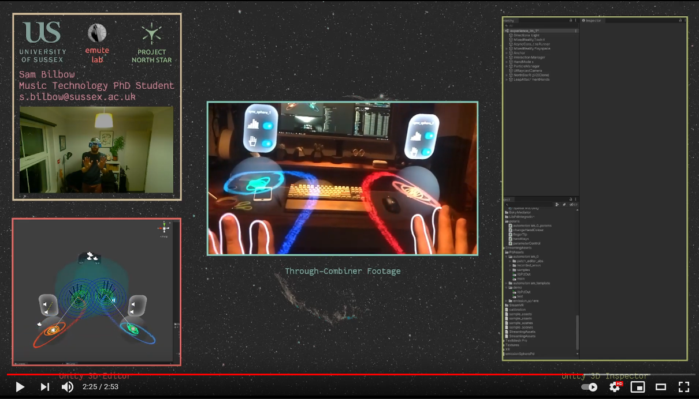
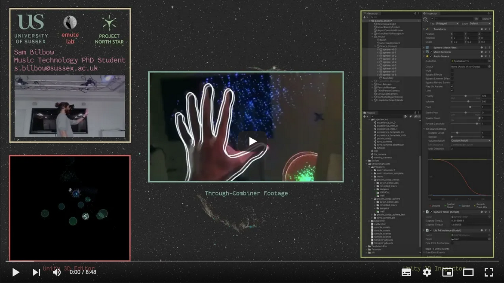
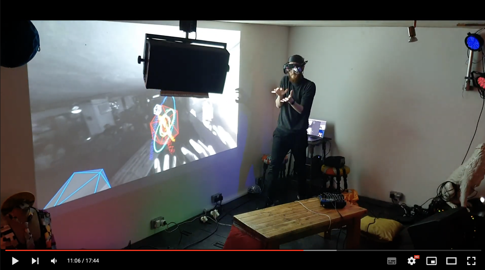

# polaris~ - Developing open-source multisensory AR instruments / experiences.
## Summary

If an AR system can be thought of as one that combines real and virtual processes, is interactive in real-time, and is registered in three dimensions; why do we witness the majority of AR applications utilising primarily visual displays of information? I propose a practice-led compositional approach for developing multisensory AR experiences’, arguing that, as an medium that combines real and virtual multisensory processes, it must explored with a multisensory approach.

This project uses the open-source [Project North Star](https://docs.projectnorthstar.org/) HMD from Leap Motion alongside bone-conduction headphones to deliver a spatialised audio-visual experience via Unity called polaris~.

[Project Link](https://sambilbow.com/projects/polaris)

[Conference Paper](https://doi.org/10.21428/92fbeb44.8abb9ce6)

### Components 
- [Software Companion](https://github.com/HyperLethalVector/ProjectEsky-UnityIntegration) for the [Project North Star](https://docs.projectnorthstar.org/) open-source AR headset that allows developing Unity scenes with MRTK/Leap Motion assets.
- [LibPdIntegration](https://github.com/LibPdIntegration/LibPdIntegration): a wrapper for [libpd](https://github.com/libpd/libpd) that allows for the implementation of [Pure Data](https://puredata.info/) patches into [Unity](https://unity3d.com/)
- [Automatonism](https://www.automatonism.com/the-software): a library of [Pure Data Vanilla](https://puredata.info/) patches that emulate modules of a synthesizer.
- A set of example scripts and scenes that use the above components to demonstrate possible interactions between head/hand tracking and patch parameters in Pd, with the chief aim of creating a set of expressive multisensory AR instruments / experiences.

## Technical Setup
### Hardware features
- Six degrees-of-freedom (3D position / orientation) head tracking via [Intel T261]()
- 90 fps, 170° hand tracking via [Ultraleap](https://www.ultraleap.com/product/stereo-ir-170/)
- Single piece optical combiner allowing for up to 110° horizontal FoV
- 2x 120Hz displays per-eye for a total resolution of 2880x1600 
- 2x 3-metre cables (1x miniDP, 1x USB-A 3.1)
- Spatial audio AR (the ability to hear localised sound whilst being able to hear your real audio environment) via Unity3D and [Aftershokz Aeropex](https://aftershokz.co.uk/products/aeropex) bone conduction headphones.

### Engine (Unity3D / Project Esky) features
- The ability to create 3D scenes that contain 'GameObjects' that in turn can have visual attributes such as 3D meshes, material colours, and textural properties; physical attributes such as edges, position, mass, velocity and real-time parameterisation via C# scripting.
- Thanks to Project Esky, the headset is created as a GameObject with real-time position / orientation.
- Thanks to [LeapMotion](https://github.com/leapmotion/UnityModules), hands (all the way down to individual finger joints) are created as GameObjects with real-time position / orientation relative to the headset.

### Audio (LibPdIntegration/Pd) features
- [LibPdIntegration](https://github.com/LibPdIntegration/LibPdIntegration) uses **native Unity3D audio spatialisation**. This is great because it means that a GameObject can output the signal of a Pd patch whilst moving, rotating and scaling. The effect of these can perceived in real-time because the AudioListener is anchored to the real-time headset position. This, for example, means that the volume of a Pd patch whose signal is being transmitted from a GameObject located in space is automatically scaled dependent on its distance to the participants head (quieter as it gets further away, louder as it is brought closer).
- [LibPdIntegration](https://github.com/LibPdIntegration/LibPdIntegration) can **'instance' Pd patches**, meaning it can use one patch on multiple GameObjects, but maintain processes like randomness within them as they are technically different 'instances' or versions of the patch.
- [Pure Data](https://puredata.info/) allows **extended audio techniques** through an extensive library of algorithmic 'objects' that can create and manipulate audio signals.
- [LibPdIntegration](https://github.com/LibPdIntegration/LibPdIntegration) allows **real-time parameter control** in Unity of any object in a Pd patch via "receive" objects and a specific C# method.
- The combination of "Play Mode" toggling in Unity, and the quick visual patching style of [Pure Data](https://puredata.info/) means that audio-visual interactions can be **prototyped very rapidly**

## September 2021 - Prototyping Experiences

## October 2021 - User Studies

## February 2022 - Experimental AR Performance 

## Caveats
Although there is a great deal that could be done to ensure equity of computational power around the planet, polaris~ strives to use completely **open-source, free and, where possible cross-platform**, elements in order to increase accessibility to cutting-edge AR technologies for those who often can't afford the mainstream consumer alternatives. The only exceptions to this so far is:
- polaris~ requires a computer to create the scenes in Unity.
  - *Cheaper wearable compute packs are currently being prototyped by CombineReality.*
- Project Esky being Windows only. This is because there is no up-to-date MacOS Ultraleap (hand tracking) driver. 
  - *Ultraleap are working on this for their V5 release (some time in 2021), but would still require a Project Esky rewrite as far as I know*
- The firmware code for the head-tracker is not open-sourced by Intel `and the product range has just been discontinued!!` Whilst this is not necessary for the project, it could have allowed further interaction. 
  - *Some geniuses are working on implementing open-source modular [Luxonis](https://shop.luxonis.com/collections/modular-cameras) cameras to replace the head-tracking sensor that the project currently relies on Intel for*
- My audio AR solution, which is currently a set of wireless [Aftershokz Aeropex](https://aftershokz.co.uk/products/aeropex) bone conduction headphones are pricy. 
  - *I am very interested in desigining a bone conduction transducer design which is mounted to the headset itself, similar to how the Vive VR headset has speakers that are attached to its main body. Alternatively, cheaper bone-conduction headphones can be used.*

## Quickstart
`Coming Soon`
### Setting up a new instrument/experience project
### Deciding on your hands
### How to use LibPdIntegration
### Using LibPdIntegration with Automatonism

## Inspiration and Similar Projects
- [Listening Mirrors](http://listeningmirrors.net/): an audio AR interactive installation by my PhD supervisors
- [Laetitia Sonami](https://sonami.net/): pioneer in early glove-based interactive music systems
- [Atau Tanaka](https://www.youtube.com/watch?v=p8CKjmE7zys): interactive gestural synthesis using muscle sensors
- [Keijiro Takahashi](https://github.com/keijiro) specifically their work with audio-reactivity in Unity.
- [Tekh:2](https://github.com/TEKH2/XR-Audio-Visual-Instruments) with their work with XR instruments using granular synthesis in Unity.

## Acknowledgements
- [Noah Zerkin](https://twitter.com/noazark) (CombineReality) for their help in understanding some specifics workings of the North Star headset.
- [Damien Rompapas](https://www.linkedin.com/in/dr-damien-rompapas-3a4b63170/?originalSubdomain=jp) (BEERLabs / ThinkDigital) for their explaining and debugging of Project Esky to me.
- [Bryan Chris Brown](https://twitter.com/BryanChrisBrown) (CombineReality) for their moderation of the very friendly [Discord server](https://discord.gg/WnzNZa3qnf) and considerable explanations of the benefits of working with the North Star headset.

## Credits
- [Project North Star](https://docs.projectnorthstar.org/) is the 3D printable AR headset by LeapMotion that has been open-source since 2018.

- [Project Esky](https://github.com/HyperLethalVector/ProjectEsky-UnityIntegration) is developed by [Damien Rompapas](/) at BEERLabs / ThinkDigital. **If you use polaris~ in an academic context, please cite [their paper](https://dl.acm.org/doi/10.1145/3411763.3451804)**

- [LibPdIntegration](https://github.com/LibPdIntegration/LibPdIntegration) is developed by [Niall Moody](http://www.niallmoody.com) at [Abertay University](http://www.abertay.ac.uk), with assistance from [Yann Seznec](http://www.yannseznec.com/). It is licensed under the [MIT License](https://github.com/LibPdIntegration/LibPdIntegration/blob/master/LICENSE.txt).

- [Automatonism](https://www.automatonism.com/the-software) is developed by [Johan Erikkson](https://www.linkedin.com/in/johan-eriksson-ph-d-84393a56/).
